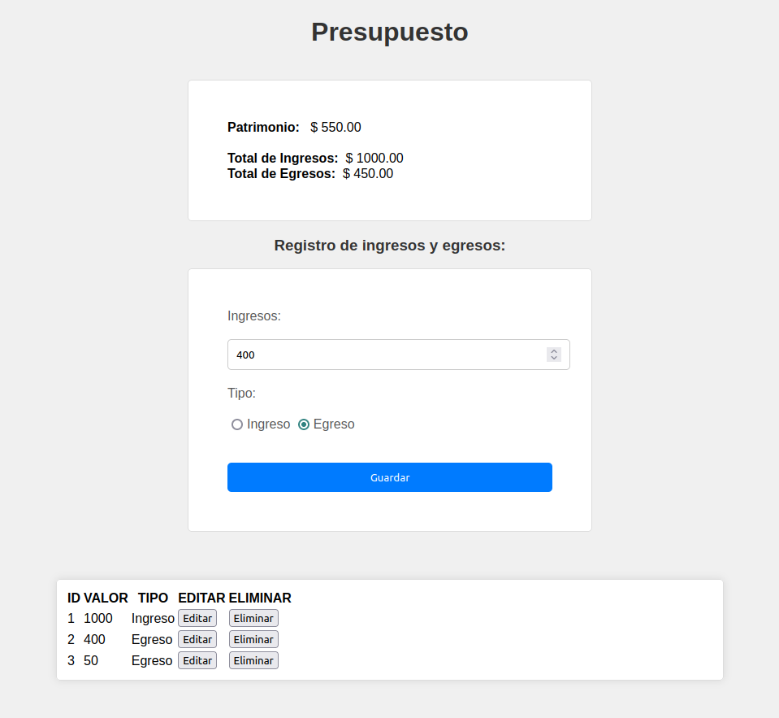
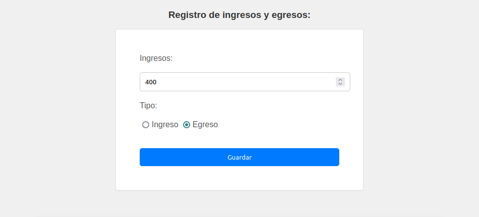
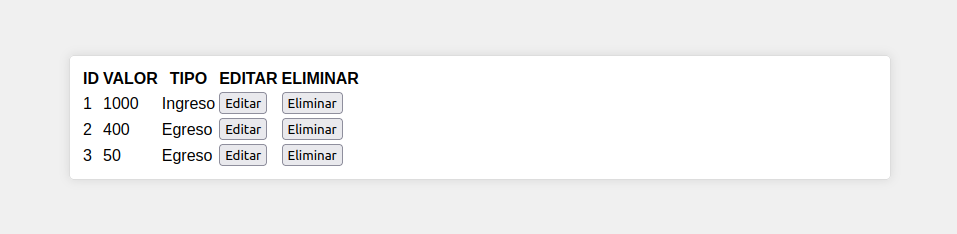
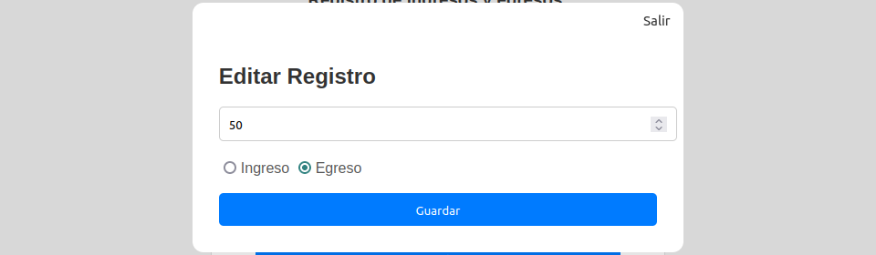
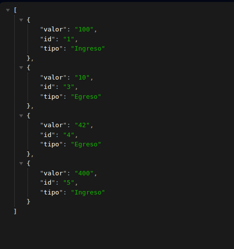

# Registro de Ingresos y Egresos

Este proyecto consiste en una aplicación web que te permite llevar un registro de tus ingresos y egresos financieros. Con esta aplicación, podrás agregar, eliminar y editar registros de manera sencilla y eficiente.

Funcionalidades principales:

## Interfaz de usuario:

---

## Funcionalidades:

---

### 1. Ver balance

Aquí podremos ver el balance del presupuesto

---

### 2. Agregar un Registro

   
Puedes añadir nuevos registros de ingresos o egresos proporcionando la siguiente información:

- **Tipo de Transacción:** Indica si se trata de un ingreso o un egreso.
- **Monto:** Especifica la cantidad de dinero involucrada en la transacción.

--- 

### 3. Eliminar un Registro

Si cometes un error o simplemente deseas eliminar un registro, puedes hacerlo de manera fácil. La aplicación te permite seleccionar el registro que deseas eliminar.

---
### 4. Editar un Registro

En caso de que necesites corregir información en un registro existente, puedes editarlos sin problemas. Simplemente selecciona el registro que deseas modificar y realiza los cambios necesarios.

---

### Vista de la estructura json

---
### API:

https://mockapi.io/ 

---
## Lenguajes:

- JavaScript
- Html
- Css

---
### ¿Te gustó esta plataforma?

#### Clona el repositorio:

`git clone https://github.com/robersks/Presupuesto.git)https://github.com/robersks/Presupuesto.git`
